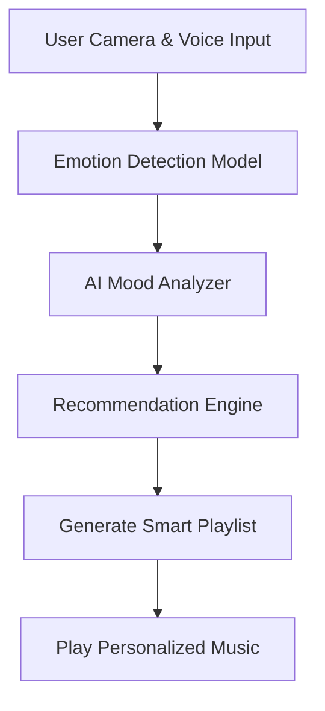
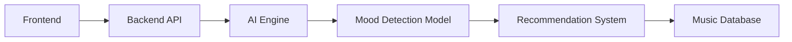

# 🎵 VIBE AI — Smart Music Player with AI Assistant & Mood Detection

<div align="center">


<br/>


</div>

---

## 🌌 About The Project

**VIBE AI** is an intelligent music player that combines:

- 🎧 Smart Music Streaming
- 🤖 AI Voice Assistant
- 😊 Real-Time Mood Detection
- 🎼 Emotion-Based Recommendations
- 🧠 AI Personalized Playlists
- 🌙 Dynamic UI Based on Mood

The system analyzes facial expressions, voice tone, and listening behavior to understand the user's mood and automatically play matching songs.

---

# ✨ Features

<table>
<tr>
<td width="50%">

### 🤖 AI Assistant
- Smart playlist generation
- Song recommendations
- AI chat integration
- Music search assistant

</td>

<td width="50%">

### 😊 Mood Detection
- Mood-based playlists
- Stress detection
- Adaptive recommendations

</td>
</tr>

<tr>
<td width="50%">

### 🎵 Music Experience
- High-quality audio player
- Lyrics synchronization
- Playlist management
- Favorites & history
- Shuffle & smart queue

</td>

<td width="50%">

### 🎨 Interactive UI
- Animated modern interface
- Dynamic background effects
- Responsive design
- Dark/Light mode
- Visual music effects

</td>
</tr>
</table>

---

# 🧠 How AI Works



---

# 🖥️ Tech Stack

<div align="center">

| Frontend | Backend | AI/ML | Database |
|----------|----------|--------|-----------|
| React.js | Node.js | TensorFlow | MongoDB |
| Tailwind CSS | Express.js | OpenCV | Firebase |
| Framer Motion | Flask API | DeepFace | MySQL |

</div>

---

# 🎯 Mood Detection Categories

| Mood | Playlist Type |
|------|----------------|
| 😄 Happy | Energetic & Party Songs |
| 😢 Sad | Calm & Emotional Songs |
| 😌 Relaxed | Lo-Fi & Chill Beats |
| 😡 Angry | Soft Instrumentals |
| 😎 Motivated | Workout & Hustle Tracks |
| 😴 Sleepy | Sleep Therapy Music |

---


# ⚡ Installation

```bash
# Clone the repository
git clone https://github.com/yourusername/aurasync-ai.git

# Navigate to project folder
cd aurasync-ai

# Install dependencies
npm install

# Start frontend
npm run dev

# Start backend
npm start
```

---

# 🚀 Future Enhancements

- 🎤 AI DJ Mode
- 🧠 Brainwave Music Synchronization
- 🌍 Multi-language Assistant
- 🥽 VR Music Experience
- 🫀 Heartbeat-Based Recommendations
- 🎹 AI Generated Music

---

# 📊 Project Architecture



---

# 🏆 Why This Project?

✔ Combines AI + Entertainment  
✔ Real-world ML application  
✔ Emotion-aware recommendation engine  
✔ Modern interactive UI  
✔ Innovative and futuristic concept  

---

# 🤝 Contributing

Contributions are welcome!

```bash
Fork 🍴
Clone 📥
Create Branch 🌱
Commit Changes 💡
Push 🚀
Create Pull Request 🎉
```

---

<div align="center">

## 🎶 "Music understands emotions better than words."

⭐ Star this repository if you like the project!

</div>
